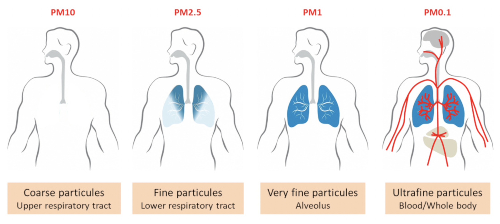
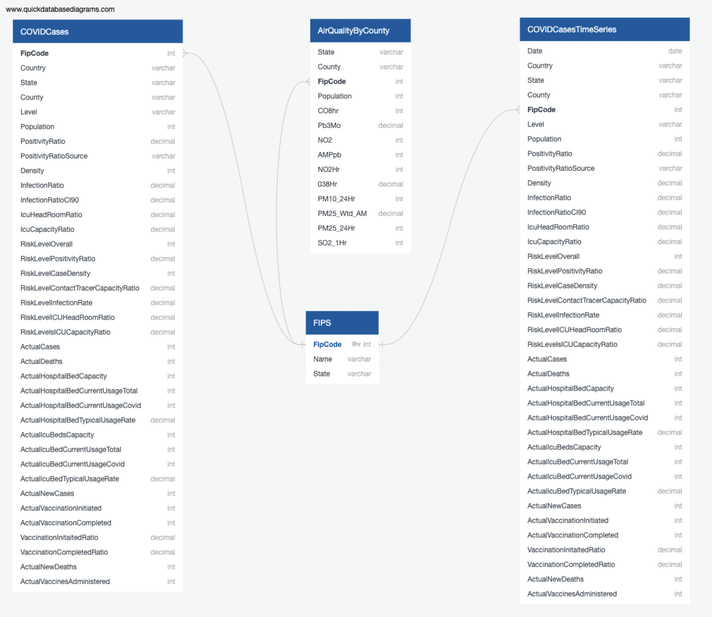
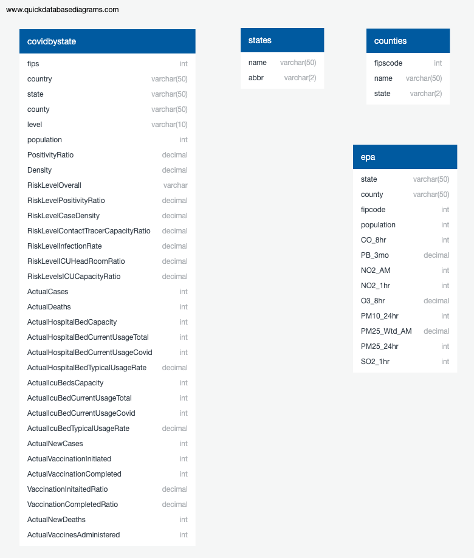

# UT-VIRT-DATA-Group-6-Project

## Presentation
Here is a link to our google slides presentation
- https://docs.google.com/presentation/d/1QtQoBtW4AktTGot_MRScFSNJ2KotpPKPlfP7MPlIExM/edit?usp=sharing

Also, checkout our dashboard at the following link:
https://ut-covid-project.herokuapp.com/

## Project Background: Particulate Matter and COVID-19 Outcomes

Air pollution is a major public health concern due to its negative impact on individual and population health. A major component of air pollution is particulate matter (PM), which is the solid and liquid particles suspended in air. PM can enter the body through various route depending on the size, shape, and concentration. However, the most common route is inhalation, which negatively affect areas of the respiratory, cardiovascular, cardiopulmonary, and reproductive systems.



PM 2.5, for example, can reach the lower respiratory system. Studies have shown that increased concentrations of fine particulate matter can cause elevated susceptibility to respiratory disease. This, in turn, may exascerbate the symptoms caused by COVID-19, and increase hospitalizations and deaths due to COVID-19.

### Project Objective

For our final project, we have chosen to create a machine learning model to assess the relationship between PM2.5 (atmospheric particulate matter with diameter less than 2.5 μm) and the clinical outcomes of COVID-19. The question we hope to answer is as follows: does increased concentrations of particulate matter contribute to an increase in the severity of COVID-19 symptoms, and lead to higher hospitalization and death rates?

We selected this topic (PM 2.5 and COVID-19) becuase this disease has had an immense impact on the world. Understanding what exascerbates COVID-19 symptoms - contributes to COVID associated hospitalizations and death - is an important and fascinating area of study. This is also a great opportunity to exercise the skills we've learned in our data analysis program.

## Database Integration

Pulling data from covidactnow.org and US EPA using following api:

- [covidactnow.org](apidocs.covidactnow.org)
- [United States Evironmental Protection Agency](https://www.epa.gov/air-trends/air-quality-cities-and-counties)

## Database Design



### Sqlite Database


## Machine Learning Model

The basic procedure for implementing a supervised learning model is as follows:

- Create a model with LogisticRegression().
- Train the model with model.fit().
- Make predictions with model.predict().
- Validate the model with accuracy_score().

Our model will use logistic regression to predict a binary outcome. Our logistic regression model will be able to decide - based on county level data - whether higher concentrations of PM 2.5 are associated with COVID-19 outcomes. We use Matplotlib and Pandas libraries. We use sklearn to split the datasets into training and test sets. We then make predictions and test accurary

The rationale behind the use of this model - rather than a different model - is that a logistic regression model predicts binary outcomes. In essense, we're creating a threshold. Everyone below this threshold is classified as low exposure to particulate matter. Everyone above is classified as high exposure. From a clinical perspective, everyone is exposed to some amount of particulate matter, but a low level may not have a health impact. Only those who are exposed high concentrations - above the threshold are at high risk. And, consequently, this model is a good choice.


### Description of the tool(s) that will be used to create final dashboard

### Python: Getting Started

A barebones Django app, which can easily be deployed to Heroku.

This application supports the [Getting Started with Python on Heroku](https://devcenter.heroku.com/articles/getting-started-with-python) article - check it out.

### Running Locally

Make sure you have Python 3.9 [installed locally](https://docs.python-guide.org/starting/installation/). To push to Heroku, you'll need to install the [Heroku CLI](https://devcenter.heroku.com/articles/heroku-cli), as well as [Postgres](https://devcenter.heroku.com/articles/heroku-postgresql#local-setup).

```sh
$ git clone https://github.com/heroku/python-getting-started.git
$ cd python-getting-started

$ python3 -m venv getting-started
$ pip install -r requirements.txt

$ createdb python_getting_started

$ python manage.py migrate
$ python manage.py collectstatic

$ heroku local
```

Your app should now be running on [localhost:5000](http://localhost:5000/).

### Deploying to Heroku

```sh
$ heroku create
$ git push heroku main

$ heroku run python manage.py migrate
$ heroku open
```
or

[](https://heroku.com/deploy)

### Documentation

---go to:

- [Python on Heroku](https://devcenter.heroku.com/categories/python)

